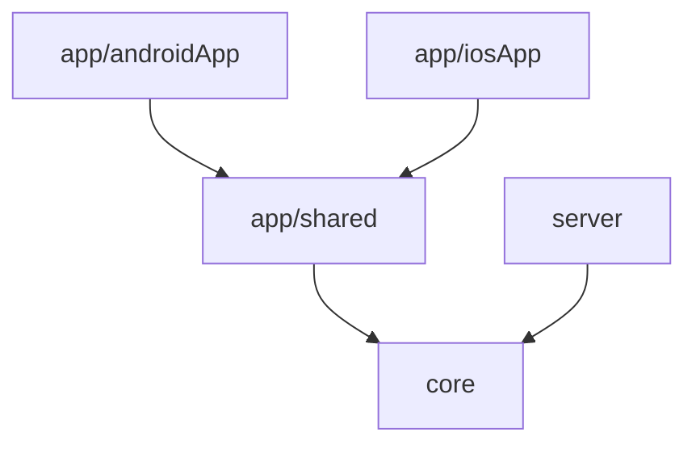

# AGENTS.md

Guidance for AI agents working in this repository.

## Read This First

1. Read [`README.md`](./README.md) for human-oriented product and project context.
2. Read [`PRD.md`](./PRD.md) for product requirements and feature scope.
3. Use this file for implementation rules, architecture constraints, and safe edit workflow.
4. For common step-by-step workflows (add a screen, add an endpoint, etc.) see [`SKILL.md`](./SKILL.md).
5. When working inside a specific module, also read its scoped `AGENTS.md` listed in [Sub-Module Guidance](#sub-module-guidance).

## Project Snapshot

- Project: **Be-Fair**
- Package: `dev.jakubzika.befair`
- Targets: Android, iOS, JVM server
- Tech Stack:
    - Kotlin Multiplatform
    - Backend: Ktor server (Netty)
    - Mobile UI: Compose Multiplatform (Material 3), Navigation 3
    - Font: Inter (Compose resources)
    - DI: Manual container (no framework)

## Modules and Ownership

Defined in `settings.gradle.kts`:

| Module | Purpose | Depends on |
|--------|---------|------------|
| `app/shared` | Compose UI, mobile domain/data/model layers | `core` |
| `app/androidApp` | Android entry point | `app/shared` |
| `app/iosApp` | iOS entry point (Xcode) | `app/shared` |
| `core` | Shared domain, data, model for all platforms | — |
| `server` | Ktor server (Netty) | `core` |



## Module Placement — apply before creating or moving any file

Decide placement explicitly *before* writing code, not after. The one rule:

- **`core` only holds code consumed by more than one target.** In practice the server consumes only **DTOs, models, constants, and pure domain logic** from `core` — it has no Compose UI, no Ktor *client*, and no secure storage. So "shared with the server" almost always means *a data class*, not client infrastructure.
- **If the server will never use it → `app/shared`** (Android/iOS). **If mobile will never use it → `server`.**
- **Smell test:** if you must write a stub/no-op `actual` for a target that never uses the code (e.g. a JVM `TokenStorage` the server ignores), it's in the wrong module — move it to `app/shared`.

Full table: [SKILL.md → Module Placement](./SKILL.md#module-placement--decide-this-first).

## Source Set Rules

- Prefer `commonMain` for cross-platform logic.
- Put platform APIs into `androidMain`, `iosMain`, or `jvmMain`.
- Use Kotlin `expect`/`actual` for platform abstractions.
- Keep tests in `commonTest` when behavior is shared.

## Software Architecture

### Mobile (Clean Architecture)

```
app/shared/
├── ui/           # Presentation — Compose screens and components (atomic design)
│   ├── atoms/        # Basic reusable UI pieces (Button, Colors, Theme, Title). Unique components.
│   ├── molecules/    # Simple groups of atoms functioning together as a unit.
│   ├── organisms/    # Complex components composed of molecules, atoms, and/or other organisms.
│   ├── templates/    # Page-level layouts that place components and define content structure (e.g. LoginTemplate).
│   └── screens/      # Specific instances of templates filled with real data (e.g. LoginScreen, HomeScreen).
├── domain/       # Use-cases (business logic)
├── data/         # Repositories and controllers
└── model/        # Model classes shared across layers
```

See [`app/shared/.../ui/AGENTS.md`](app/shared/src/commonMain/kotlin/dev/jakubzika/befair/ui/AGENTS.md) for the full UI component layer rules. When adding a new component, place it at the lowest suitable layer.

### Server

All server-only code in `server/`. Shared logic with mobile goes in `core/`.

## Dependency Injection

No DI framework — uses manual dependency containers:

- `core/.../di/CoreContainer.kt` — shared instances (e.g. `httpClient`).
- `app/shared/.../di/AppContainer.kt` — mobile-specific instances, wraps `CoreContainer` (exposed as `coreContainer`).
- Container provided to composables via `CompositionLocalProvider(LocalAppContainer provides container)`.
- Accessed in composables via `LocalAppContainer.current`.

```kotlin
// Correct — access via CompositionLocal
val container = LocalAppContainer.current
val repo = container.profileRepository

// Wrong — instantiate directly in a composable
val repo = ProfileRepositoryImpl(httpClient) // breaks DI, untestable
```

## Build, Run, and Test Commands

```shell
# Android
./gradlew :app:androidApp:assembleDebug

# Server (Ktor on Netty)
./gradlew :server:run

# iOS — open app/iosApp/ in Xcode and run from there

# All tests
./gradlew test

# Module tests
./gradlew :app:shared:testDebugUnitTest
./gradlew :server:test
./gradlew :core:testDebugUnitTest
```

## Version and Dependency Source of Truth

Use `gradle/libs.versions.toml` for versions and plugin aliases.

## Gotchas

- `BeFairTypography()` is a `@Composable` function (loads Inter via Compose resources) — call it only inside composition, never assign to a top-level `val`.
- The `primary-fixed` color families in `Color.kt` are standalone `val` declarations, not part of `lightColorScheme`/`darkColorScheme` — they do not adapt between light/dark mode.
- `LocalAppContainer` uses `staticCompositionLocalOf` and errors if no value is provided — every composable tree must be wrapped with the provider in `App.kt`.
- `expect fun getPlatform(): Platform` lives in `core` with `actual` implementations in `androidMain`, `iosMain`, and `jvmMain` — not in `app/shared`.
- `HttpClientFactory` follows the same `expect`/`actual` pattern in `core` across all three platform source sets.
- The iOS app is an Xcode project, not a Gradle target — `./gradlew` commands do not build or test iOS.

## Boundaries

### Always do
- Place code in the correct module and source set.
- Use `gradle/libs.versions.toml` for all dependency versions.
- Follow atomic design for UI: atoms → molecules → organisms → templates → screens.
- Wire new dependencies through the DI containers (`CoreContainer` or `AppContainer`).
- Validate changes with the smallest relevant test or build command.

### Ask first
- Adding a new Gradle module or changing `settings.gradle.kts`.
- Introducing a new third-party library.
- Changing the DI container structure or `CompositionLocal` setup.
- Modifying GitHub Actions workflows (`.github/`).
- Altering the Ktor server routing or serialization setup.

### Never do
- Hard-code hex color values in composables.
- Instantiate repositories or data sources directly in composables — use the DI container.
- Add platform-specific code to `commonMain`.
- Place mobile-only or client-only code (secure storage, Ktor client/auth config, Compose, anything that imports Android/iOS or only the app uses) in `core` — it is for genuinely multi-target code only.
- Modify generated or build output directories.
- Remove or rename existing public API without confirming no other module depends on it.
- Skip the version catalog and add raw dependency coordinates in `build.gradle.kts`.

## Agent Workflow Expectations

- Make minimal, targeted edits; avoid unrelated refactors.
- Keep module boundaries intact.
- Before creating or moving a file, state its target **module + source set** and justify it by **which targets consume it**. If the answer is `core`, re-read [`core/AGENTS.md`](./core/AGENTS.md) first.
- If requirements are ambiguous, state assumptions briefly in your response.
- Update documentation when behavior or workflow changes.

## Safe Change Checklist

Before finishing, verify:

1. Code is in the correct module and source set.
2. Imports/dependencies align with existing version catalog usage.
3. Relevant tests/build commands pass for touched modules.
4. New composables use `MaterialTheme.*` tokens, not hard-coded values.
5. New dependencies are wired through the DI container, not instantiated inline.
6. Documentation is updated when behavior or workflow changes.

## Sub-Module Guidance

Each module has a scoped `AGENTS.md` with rules specific to that area. Read it when working in that module.

| Module | File |
|---|---|
| `core` | [`core/AGENTS.md`](./core/AGENTS.md) |
| `server` | [`server/AGENTS.md`](./server/AGENTS.md) |
| `app/shared` UI layer | [`app/shared/src/commonMain/kotlin/dev/jakubzika/befair/ui/AGENTS.md`](./app/shared/src/commonMain/kotlin/dev/jakubzika/befair/ui/AGENTS.md) |

