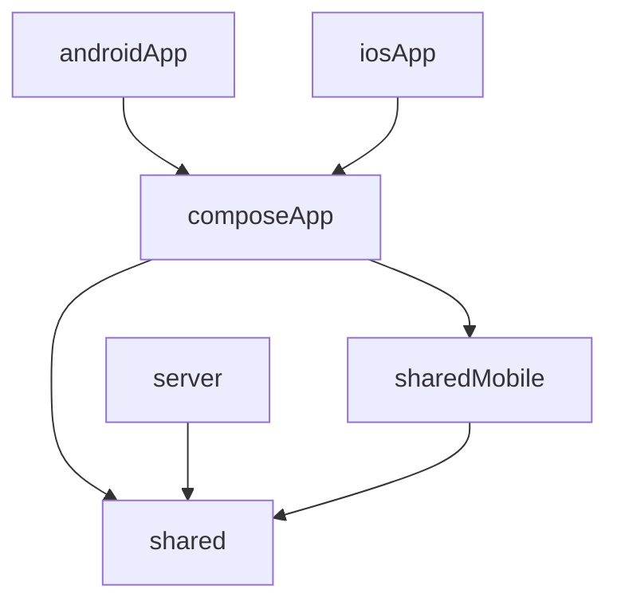

# AGENTS.md

Guidance for AI agents working in this repository.

## Read This First

1. Read [`README.md`](./README.md) for human-oriented product and project context.
2. Use this file for implementation rules, architecture constraints, and safe edit workflow.

## Project Snapshot

- Project: **Be-Fair**
- Package: `dev.jakubzika.befair`
- Stack: Kotlin Multiplatform, Compose Multiplatform (Material 3), Ktor server
- Targets: Android, iOS, JVM server

## Modules and Ownership

Defined in `settings.gradle.kts`:

- `composeApp` - shared Compose UI module for Android and iOS; dependes on `sharedMobile` and `shared`.
- `androidApp` - Android application entry point; depends on `composeApp`.
- `iosApp` - iOS application entry point; depends on `composeApp`.
- `sharedMobile` - shared domain, data, and model layer for mobile platforms only (Android & iOS) only; depends on `shared`.
- `shared` - shared domain, data, and model layer common for all platforms (Android, iOS, and JVM).
- `server` - Ktor server module (Netty); depends on `shared`.

## Source Set Rules

- Prefer `commonMain` for cross-platform logic.
- Put platform APIs into `androidMain`, `iosMain`, or `jvmMain`.
- Use Kotlin `expect`/`actual` for platform abstractions.
- Keep tests in `commonTest` when behavior is shared.

## Software Architecture

### General
Follow [Clean Architecture](https://blog.cleancoder.com/uncle-bob/2012/08/13/the-clean-architecture.html) rules.

Graphical representation module dependencies:


### Mobile Architecture
- Presentation layer represented by `composeApp` module. Definition colors, theming, components, screen navigation, and follows [UI Architecture](#ui-architecture-composeapp).
- Domain layer for mobile platform represented by `sharedMobile` module by `domain` folder. Defines use-cases which represents business logic.
- Data layer for mobile platform represented by `sharedMobile` module by `data` folder. Defines repositories and controllers.
- Model layer for mobile platform represented by `sharedMobile` module by `model` folder. Defines model classes sharable through layers.

#### UI Architecture (composeApp)

UI code is under `composeApp/src/commonMain/kotlin/dev/jakubzika/befair/ui/` and follows [atomic design](https://atomicdesign.bradfrost.com/chapter-2/):

- `atoms/` - Basic reusable UI pieces (`Button`, `Colors`, `Theme`, `Title`, etc.). Those components are unique.
- `molecules/` - Are relatively simple groups of `atoms` functioning together as a unit.
- `organisms/` - Are relatively complex UI components composed of groups of `molecules` and/or `atoms` and/or other `organisms`.
- `templates/` - Templates are page-level objects that place components into a layout and articulate the design’s underlying content structure. It's a combination of `atoms`, `molecules`, and `organisms` (for example `LoginTemplate`).
- `screens/` - Pages are specific instances of templates that show what a UI looks like with real representative content in place. Displays `template` and fills it by data (for example `LoginScreen`, `HomeScreen`, etc.).

When editing UI, preserve this structure and place new components at the lowest suitable layer.

### Server Architecture
- All server only implementation is represented by `server` module.
- If there is something shared with mobile platform, it is placed in `shared` module.

## Dependency Injection

Project does not use any kind of dependency injection framework. It uses own dependency container
with the main component instances creation (`shared/src/commonMain/kotlin/dev/jakubzika/befair/di/AppContainer.kt`).

## Build, Run, and Test Commands

```shell
# Android
./gradlew :androidApp:assembleDebug

# Server (Ktor on Netty)
./gradlew :server:run

# iOS
# Open iosApp/ in Xcode and run from Xcode

# All tests
./gradlew test

# Module tests
./gradlew :composeApp:testDebugUnitTest
./gradlew :server:test
./gradlew :shared:testDebugUnitTest
```

## Version and Dependency Source of Truth

Use `gradle/libs.versions.toml` for versions and plugin aliases.

## Agent Workflow Expectations

- Make minimal, targeted edits; avoid unrelated refactors.
- Do not modify generated/build output directories.
- Keep module boundaries intact (UI in `composeApp`, mobile only shared logic in `sharedMobile`, shared logic for all platforms in `shared`, backend in `server`).
- Validate changed behavior with the smallest relevant test task when possible.
- If requirements are ambiguous, state assumptions briefly in your response.

## Safe Change Checklist

Before finishing, verify:

1. Code is in the correct module and source set.
2. Imports/dependencies align with existing version catalog usage.
3. Relevant tests/build commands pass for touched modules.
4. Documentation is updated when behavior or workflow changes.
