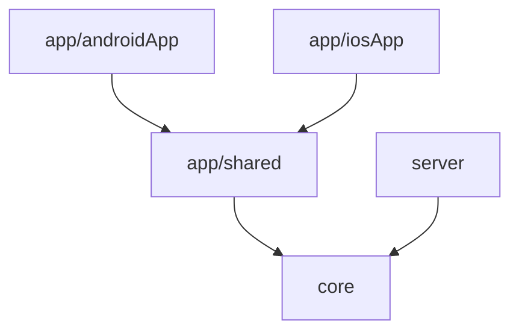

# AGENTS.md

Guidance for AI agents working in this repository.

## Read This First

1. Read [`README.md`](./README.md) for human-oriented product and project context.
2. Use this file for implementation rules, architecture constraints, and safe edit workflow.

## Project Snapshot

- Project: **Be-Fair**
- Package: `dev.jakubzika.befair`
- Stack: Kotlin Multiplatform, Compose Multiplatform (Material 3), Ktor server
- Targets: Android, iOS, JVM server

## Modules and Ownership

Defined in `settings.gradle.kts`:

- `app/shared` - shared Compose UI module for Android and iOS; also contains mobile domain, data, and model layers; depends on `core`.
- `app/androidApp` - Android application entry point; depends on `app/shared`.
- `app/iosApp` - iOS application entry point; depends on `app/shared`.
- `core` - shared domain, data, and model layer common for all platforms (Android, iOS, and JVM).
- `server` - Ktor server module (Netty); depends on `core`.

## Source Set Rules

- Prefer `commonMain` for cross-platform logic.
- Put platform APIs into `androidMain`, `iosMain`, or `jvmMain`.
- Use Kotlin `expect`/`actual` for platform abstractions.
- Keep tests in `commonTest` when behavior is shared.

## Software Architecture

### General
Follow [Clean Architecture](https://blog.cleancoder.com/uncle-bob/2012/08/13/the-clean-architecture.html) rules.

Graphical representation module dependencies:


### Mobile Architecture
- Presentation layer represented by `app/shared` module. Definition colors, theming, components, screen navigation, and follows [UI Architecture](#ui-architecture-appshared).
- Domain layer for mobile platform represented by `app/shared` module by `domain` folder. Defines use-cases which represents business logic.
- Data layer for mobile platform represented by `app/shared` module by `data` folder. Defines repositories and controllers.
- Model layer for mobile platform represented by `app/shared` module by `model` folder. Defines model classes sharable through layers.

### Server Architecture
- All server only implementation is represented by `server` module.
- If there is something shared with mobile platform, it is placed in `core` module.

## Dependency Injection

Project does not use any kind of dependency injection framework. It uses own dependency container
with the main component instances creation (`core/src/commonMain/kotlin/dev/jakubzika/befair/di/AppContainer.kt`).

## Build, Run, and Test Commands

```shell
# Android
./gradlew :app:androidApp:assembleDebug

# Server (Ktor on Netty)
./gradlew :server:run

# iOS
# Open app/iosApp/ in Xcode and run from Xcode

# All tests
./gradlew test

# Module tests
./gradlew :app:shared:testDebugUnitTest
./gradlew :server:test
./gradlew :core:testDebugUnitTest
```

## Version and Dependency Source of Truth

Use `gradle/libs.versions.toml` for versions and plugin aliases.

## Agent Workflow Expectations

- Make minimal, targeted edits; avoid unrelated refactors.
- Do not modify generated/build output directories.
- Keep module boundaries intact (UI and mobile domain/data in `app/shared`, shared logic for all platforms in `core`, backend in `server`).
- Validate changed behavior with the smallest relevant test task when possible.
- If requirements are ambiguous, state assumptions briefly in your response.

## Safe Change Checklist

Before finishing, verify:

1. Code is in the correct module and source set.
2. Imports/dependencies align with existing version catalog usage.
3. Relevant tests/build commands pass for touched modules.
4. Documentation is updated when behavior or workflow changes.

## Design System

See [`DESIGN.md § 8`](./DESIGN.md#8-design-system-implementation) for the full color palette,
type scale, spacing tokens, and component patterns.

Key rule: always access colors via `MaterialTheme.colorScheme.*` and typography via
`MaterialTheme.typography.*`. Never hard-code hex values in composables.
