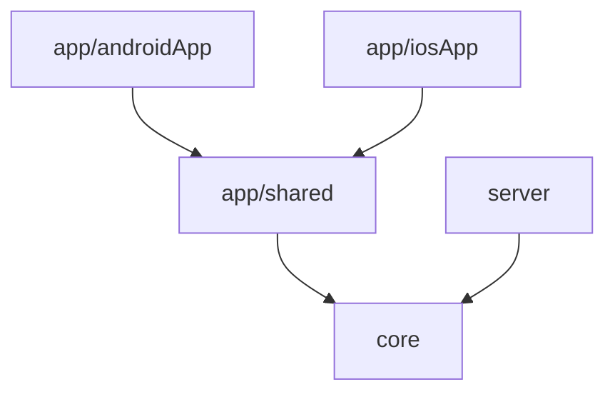

# Be-Fair

Be-Fair is application that allows you to track cost-effectiveness of your waredrobe.

## Key Features (Planned)

- **User account:** Register & Login user account.
- **Track clothes wearing & washing:** Add your clothes and track its usage.
- **Real-time Sync:** All data is synced across devices via a centralized backend.

## Tech Stack

- Kotlin Multiplatform
- Backend: [Ktor](https://ktor.io/) server (Netty)
- Mobile UI: [Compose Multiplatform](https://www.jetbrains.com/lp/compose-multiplatform/) (Material 3), Navigation 3
- Font: Inter (Compose resources)
- DI: Manual container (no framework)

## Project Structure

- `app/androidApp`: The entry point for the Android application.
- `app/iosApp`: The entry point for the iOS application.
- `app/shared`: Shared UI, navigation, and mobile domain/data logic using Compose Multiplatform.
- `core`: Shared business logic, models, and networking (all platforms).
- `server`: The Ktor backend server.



## Software Architecture
Follow [Clean Architecture](https://blog.cleancoder.com/uncle-bob/2012/08/13/the-clean-architecture.html) rules.
The design component definition follows [atomic design](https://atomicdesign.bradfrost.com/chapter-2/)

```
app/shared/
├── ui/           # Presentation — Compose screens and components (atomic design)
│   ├── atoms/        # Basic reusable UI pieces (Button, Colors, Theme, Title). Unique components.
│   ├── molecules/    # Simple groups of atoms functioning together as a unit.
│   ├── organisms/    # Complex components composed of molecules, atoms, and/or other organisms.
│   ├── templates/    # Page-level layouts that place components and define content structure (e.g. LoginTemplate).
│   └── screens/      # Specific instances of templates filled with real data (e.g. LoginScreen, HomeScreen).
├── domain/       # Use-cases (business logic)
├── data/         # Repositories and controllers
└── model/        # Model classes shared across layers
```

## Getting Started

### Prerequisites

- Android Studio (for Android and KMP)
- Xcode (for iOS development)
- JDK 17 or higher

### Running the App

#### Android
1. Open the project in Android Studio.
2. Select the `app.androidApp` run configuration.
3. Click "Run".

OR run shell command:

```shell
./gradlew :app:androidApp:assembleDebug
```

#### iOS
1. Open `app/iosApp/iosApp.xcodeproj` in Xcode.
2. Select a simulator or physical device.
3. Click "Run".

#### Backend
1. Open Terminal app.
2. Navigate to the project.
3. Run command `./gradlew :server:run`.
4. Open browser with URL `http://0.0.0.0:8080`.

#### Testing
```shell
# All tests
./gradlew test

# Module tests
./gradlew :app:shared:testDebugUnitTest
./gradlew :server:test
./gradlew :core:testDebugUnitTest
```

## Development Rules

For AI agents and developers:
- [AGENTS.md](./AGENTS.md) — architecture, module ownership, boundaries, and safe-edit guidelines.
- [DESIGN.md](app/shared/src/commonMain/kotlin/dev/jakubzika/befair/ui/DESIGN.md) — design system tokens (colors, typography, spacing) and component patterns.
- [PRD.md](./PRD.md) — product requirements and feature scope.
