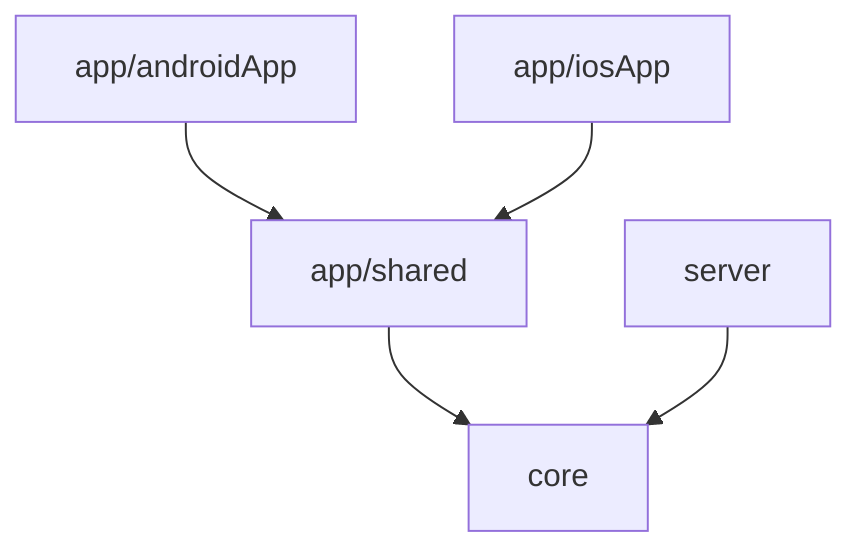

# Be-Fair

Be-Fair is an application that allows you to track the cost-effectiveness and usage value of your wardrobe.

## Key Features (Planned)

- **User account:** Register & Login user account.
- **Track clothes wearing & washing:** Add your clothes and track its usage.
- **Real-time Sync:** All data is synced across devices via a centralized backend.

## Tech Stack

- Kotlin Multiplatform
- Backend: [Ktor](https://ktor.io/) server (Netty)
- Mobile UI: [Compose Multiplatform](https://www.jetbrains.com/lp/compose-multiplatform/) (Material 3), Navigation 3
- Font: Inter (Compose resources)
- DI: Manual container (no framework)

## Project Structure

- `app/androidApp`: The entry point for the Android application.
- `app/iosApp`: The entry point for the iOS application.
- `app/shared`: Shared UI, navigation, and mobile domain/data logic using Compose Multiplatform.
- `core`: Shared business logic, models, and networking (all platforms).
- `server`: The Ktor backend server.



## Software Architecture
Follow [Clean Architecture](https://blog.cleancoder.com/uncle-bob/2012/08/13/the-clean-architecture.html) rules.
The design component definition follows [atomic design](https://atomicdesign.bradfrost.com/chapter-2/).

### Module/Package Layout Details

#### `app/shared` (Compose Multiplatform & Mobile Logic)
Located under `app/shared/src/commonMain/kotlin/dev/jakubzika/befair/`:
- `ui/` — Presentation — Compose screens, navigation, and components (atomic design)
  - `atoms/` — Basic reusable UI pieces (Button, Colors, Theme, Title). Unique components.
  - `navigation/` — Core Navigation 3 components and route definitions.
  - `organisms/` — Complex components composed of molecules, atoms, and/or other organisms.
  - `templates/` — Page-level layouts that place components and define content structure (e.g., `LoginTemplate`).
  - `screens/` — Specific instances of templates filled with real data (e.g., `LoginScreen`, `HomeScreen`).
- `domain/` — Mobile domain logic
  - `repository/` — Repository interfaces
  - `model/` — Domain model classes
- `data/` — Mobile data implementation
  - `repository/` — Repository implementations
  - `network/` — API clients / remote services
  - `storage/` — Local secure storage (tokens, profile storage)
- `di/` — Dependency injection container (`AppContainer`)

#### `core` (Shared Multiplatform business/model logic)
Located under `core/src/commonMain/kotlin/dev/jakubzika/befair/`:
- `domain/model/` — Model classes shared between mobile client and Ktor server
- `data/network/` — Shared networking setup (e.g., Ktor HttpClientFactory, API configurations)
- `di/` — Dependency injection container (`CoreContainer`)

#### `server` (Ktor Backend Server)
Located under `server/src/main/kotlin/dev/jakubzika/befair/`:
- `auth/` — Authentication and token validation utilities
- `data/db/` — Database schemas, connections, and service transactions
- `routes/` — Ktor routing and API endpoint implementations

## Getting Started

### Prerequisites

- Android Studio (for Android and KMP)
- Xcode (for iOS development, macOS only)
- **JDK 21 or higher**

### Running the App

#### Android
1. Open the project in Android Studio.
2. Select the `app.androidApp` run configuration.
3. Click "Run".

OR run the shell command:

```shell
./gradlew :app:androidApp:assembleDebug
```

#### iOS
1. Open `app/iosApp/iosApp.xcodeproj` in Xcode (requires macOS).
2. Select a simulator or physical device.
3. Click "Run".

#### Backend
1. Open a terminal.
2. Run the command:
```shell
./gradlew :server:run
```
3. Open a browser with the URL `http://localhost:8080` (or as defined by `SERVER_PORT` in constants).

#### Testing
The project includes unit tests for the core shared logic and the backend server. Run specific module tests with:

```shell
# Run Ktor server backend tests
./gradlew :server:test

# Run Shared library core tests (JVM target)
./gradlew :core:jvmTest
```

## Development Rules

For AI agents and developers:
- [AGENTS.md](./AGENTS.md) — architecture, module ownership, boundaries, and safe-edit guidelines.
- [DESIGN.md](app/shared/src/commonMain/kotlin/dev/jakubzika/befair/ui/DESIGN.md) — design system tokens (colors, typography, spacing) and component patterns.
- [PRD.md](./PRD.md) — product requirements and feature scope.
